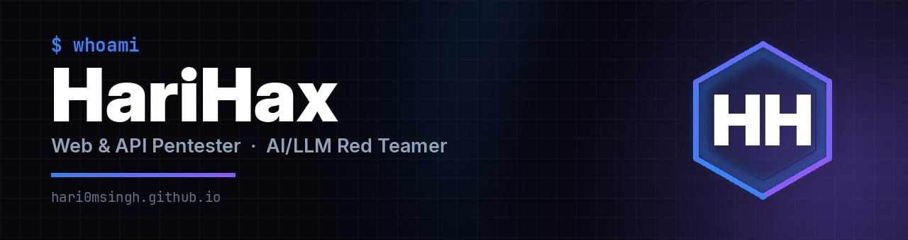

  
  
  
  
  

  

 

I test web applications, APIs, and network infrastructure for fintech and enterprise
clients. Manual-first — I chain authentication, authorization, and business logic flaws
into demonstrated impact rather than handing over scanner output. Increasingly working
on AI/LLM-integrated systems, where the methodology is least settled and the bugs are
most interesting.

Outside client work I hunt on public bug bounty programs and write up what I find.

 

## Write-ups

> ### [Everyone Chains SSTI to RCE. I Chained It to Account Takeover.](https://medium.com/@HariHax/everyone-chains-ssti-to-rce-i-chained-it-to-account-takeover-c279188ff9ce)
> Three attempts at code execution went nowhere. One template expression that just read a variable led to full account takeover.

> ### [A 400 Is Not a Dead End — My First Bug Bounty](https://medium.com/@HariHax/a-400-is-not-a-dead-end-my-first-bug-bounty-250-0fd813c24f55)
> I went hunting for SSTI. I found nothing. That "nothing" turned into my first paid finding.

 

## What I Work On

<table>
<tr>
<td width="33%" valign="top">

### Web & API
OWASP Top 10 
API Security Top 10 
IDOR / BOLA · BFLA 
SSRF · SSTI → RCE 
Auth bypasses 
Business logic 
REST & GraphQL

</td>
<td width="33%" valign="top">

### AI / LLM
Prompt injection 
(direct & indirect) 
Jailbreaking 
RAG pipeline attacks 
Agent & tool abuse 
OWASP LLM Top 10 
MITRE ATLAS

</td>
<td width="33%" valign="top">

### Network & Infra
Internal pentesting 
External pentesting 
Segmentation testing 
Service enumeration 
Misconfiguration 
analysis

</td>
</tr>
</table>

 

## Toolkit

  

  
  
  
  
  
  
  
  
  
  
  

 

## Certifications

  
  

  
  

 

---

<i>Break it before the attackers do — then help fix it.</i>

